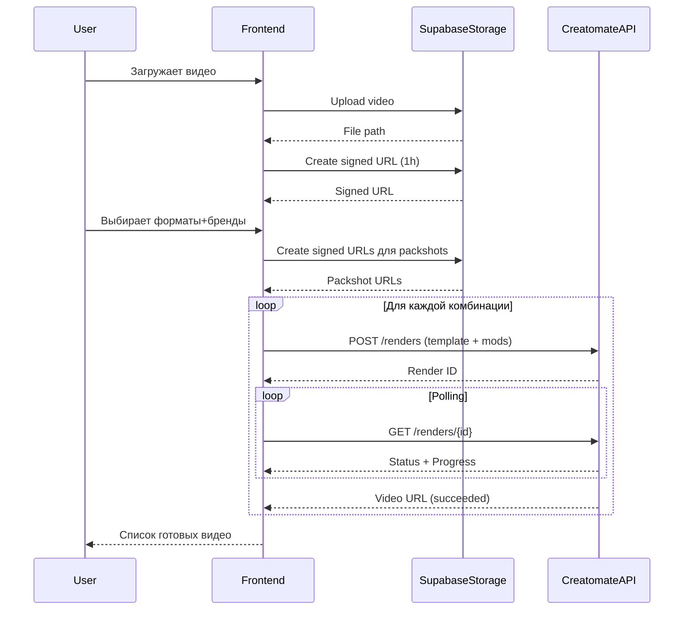
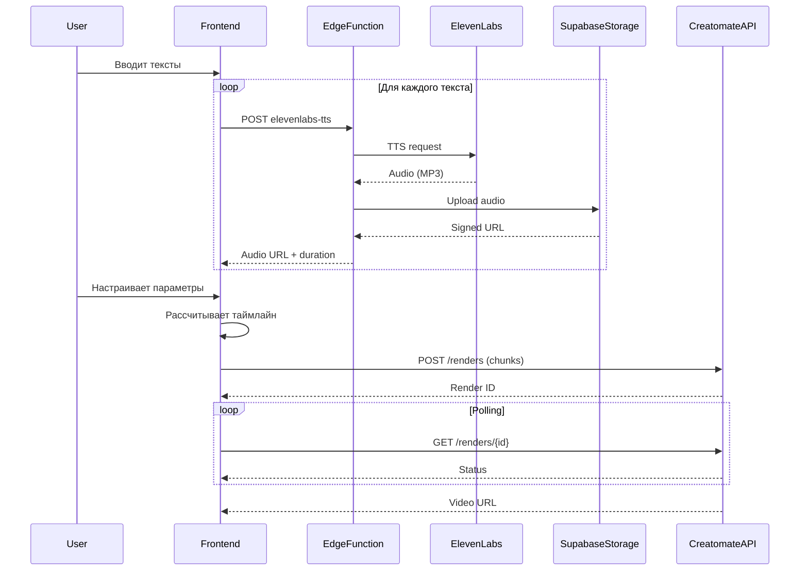
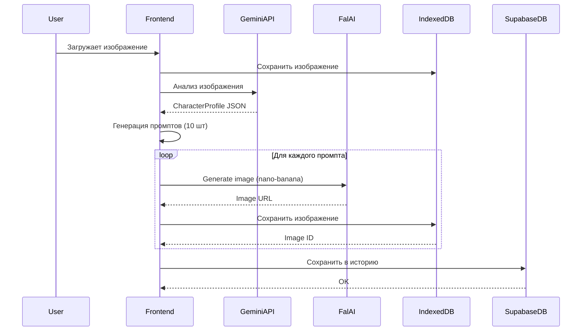

# Техническая документация платформы видеогенерации

## Оглавление
1. [Общий обзор](#общий-обзор)
2. [Архитектура системы](#архитектура-системы)
3. [Основные модули](#основные-модули)
4. [Интеграции с внешними сервисами](#интеграции-с-внешними-сервисами)
5. [Потоки данных](#потоки-данных)
6. [Хранение данных](#хранение-данных)
7. [API и сервисы](#api-и-сервисы)
8. [Развертывание и настройка](#развертывание-и-настройка)

---

## Общий обзор

Платформа представляет собой веб-приложение для автоматизированной генерации и обработки видеоконтента с использованием AI-технологий. Основные возможности:

- **Ресайз и ребрендинг** видео - адаптация готовых видео под разные форматы и бренды
- **Генерация видео из текстовых блоков** - создание видео с автоматической озвучкой
- **AI Character Studio** - генерация персонажей и сцен с помощью AI

### Технологический стек

**Frontend:**
- React 18.3.1 + TypeScript
- Vite (сборщик)
- Tailwind CSS (стилизация)
- React Router (роутинг)
- Shadcn/ui (UI компоненты)
- TanStack Query (управление состоянием)

**Backend:**
- Supabase (PostgreSQL + Auth + Storage + Edge Functions)
- Edge Functions на Deno (серверная логика)

**Внешние API:**
- Creatomate - рендеринг видео
- ElevenLabs - синтез речи (TTS)
- Google Sheets API - загрузка текстового контента
- Fal.ai - AI генерация изображений и видео
- Google Gemini - анализ изображений и генерация промптов

---

## Архитектура системы

```
┌─────────────────────────────────────────────────────────────┐
│                      React Frontend                          │
│  ┌──────────────┐  ┌──────────────┐  ┌──────────────┐      │
│  │ Video Gen    │  │ Chunked      │  │ Character    │      │
│  │ (Resize)     │  │ Audio        │  │ Studio       │      │
│  └──────────────┘  └──────────────┘  └──────────────┘      │
└─────────────────────────────────────────────────────────────┘
                            │
                            ▼
┌─────────────────────────────────────────────────────────────┐
│                   Supabase Backend                           │
│  ┌──────────────┐  ┌──────────────┐  ┌──────────────┐      │
│  │ PostgreSQL   │  │ Storage      │  │ Edge         │      │
│  │ Database     │  │ (Videos,     │  │ Functions    │      │
│  │              │  │ Audio, etc)  │  │              │      │
│  └──────────────┘  └──────────────┘  └──────────────┘      │
└─────────────────────────────────────────────────────────────┘
                            │
                            ▼
┌─────────────────────────────────────────────────────────────┐
│                   External APIs                              │
│  ┌─────────┐  ┌─────────┐  ┌─────────┐  ┌─────────┐       │
│  │Creatomate│ │ElevenLabs│ │Google   │ │Fal.ai   │       │
│  │         │  │         │  │Sheets   │ │         │       │
│  └─────────┘  └─────────┘  └─────────┘  └─────────┘       │
└─────────────────────────────────────────────────────────────┘
```

### Основные компоненты

1. **React Frontend** - Single Page Application (SPA)
2. **Supabase Backend** - serverless бэкенд
3. **External APIs** - внешние сервисы для обработки контента

---

## Основные модули

### 1. Video Generator (Resize & Rebrand)

**Назначение:** Ресайз и ребрендинг готовых видео с озвучкой.

**Путь:** `/resize-rebrand`

**Основные файлы:**
- `src/pages/ResizeRebrand.tsx` - страница
- `src/components/VideoGenerator.tsx` - основной компонент
- `src/services/creatomateService.ts` - интеграция с Creatomate
- `src/hooks/useVideoUpload.ts` - загрузка видео

**Процесс работы:**

```
1. Пользователь загружает видео ──▶ Supabase Storage
                                    │
                                    ▼
2. Система генерирует signed URL (действителен 1 час)
                                    │
                                    ▼
3. Пользователь выбирает:
   - Форматы (16:9, 9:16, 1:1, 9:16-clean)
   - Бренды (DateMyAge, OurLove, EuroDate, DatingClub)
   - Субтитры (вкл/выкл)
   - Музыку (опционально)
                                    │
                                    ▼
4. Для каждой комбинации формат+бренд:
   - Создается запрос к Creatomate API
   - Передаются signed URLs (видео + пекшот)
   - Применяются модификации (субтитры, музыка)
                                    │
                                    ▼
5. Creatomate рендерит видео
                                    │
                                    ▼
6. Готовые видео доступны по ссылкам
```

**Ключевые особенности:**
- Использует **signed URLs** для безопасной передачи медиафайлов в Creatomate
- Поддерживает **множественную генерацию** (до 4 брендов × 4 формата = 16 видео)
- **Автоматическая замена пекшотов** в зависимости от выбранного бренда
- **Субтитры** генерируются автоматически из аудиодорожки видео

### 2. Chunked Audio Scenario

**Назначение:** Создание видео из текстовых блоков с индивидуальной озвучкой каждого блока.

**Путь:** `/chunked-audio`

**Основные файлы:**
- `src/pages/ChunkedAudio.tsx` - страница
- `src/components/ChunkedAudioScenario.tsx` - основной компонент
- `src/services/elevenLabsService.ts` - TTS
- `src/services/googleSheetsService.ts` - загрузка текстов
- `supabase/functions/elevenlabs-tts/index.ts` - Edge Function для TTS
- `supabase/functions/google-sheets/index.ts` - Edge Function для Google Sheets

**Процесс работы:**

```
1. Загрузка текстов:
   - Из Google Sheets (по номеру строки)
   - Или ввод вручную
                                    │
                                    ▼
2. Выбор брендов для автозамены в тексте
   (DateMyAge → выбранный бренд)
                                    │
                                    ▼
3. Генерация аудио для каждого текстового блока:
   - Текст → ElevenLabs TTS (через Edge Function)
   - Аудио сохраняется в Supabase Storage
   - Генерируется signed URL
                                    │
                                    ▼
4. Опционально: загрузка видео для каждого блока
                                    │
                                    ▼
5. Настройка параметров:
   - Громкость аудио (0-100%)
   - Видимость субтитров (0-100%)
   - Текстовые блоки (при громкости 0%)
   - Фоновая музыка
                                    │
                                    ▼
6. Рендеринг в Creatomate:
   - Передаются все аудио/видео чанки
   - Устанавливается таймлайн (startTime + duration)
   - Генерируются субтитры для каждого чанка
   - Добавляется пекшот в конце
                                    │
                                    ▼
7. Готовые видео для всех комбинаций
```

**Ключевые особенности:**
- **До 10 текстовых блоков** (chunks) на одно видео
- **Автоматический расчет таймлайна** - каждый блок начинается после предыдущего
- **Минимальная длительность чанка** - 2 секунды (даже если аудио короче)
- **Режим "только текст"** - при громкости аудио 0% показываются текстовые блоки вместо субтитров
- **Автозамена брендов** - в тексте автоматически заменяются упоминания брендов
- **Индивидуальные видео** - можно загрузить свое видео для каждого текстового блока

### 3. Character Studio

**Назначение:** AI-генерация персонажей и сцен из загруженных изображений.

**Путь:** `/character-studio`

**Основные файлы:**
- `src/pages/CharacterStudio.tsx` - главная страница
- `src/services/conjuring/geminiService.ts` - анализ изображений через Gemini
- `src/services/conjuring/falService.ts` - генерация изображений/видео через Fal.ai
- `src/services/conjuring/storageService.ts` - локальное хранение в IndexedDB
- `src/services/conjuring/userService.ts` - работа с историей пользователя

**Процесс работы:**

```
1. Загрузка изображения персонажа
                │
                ▼
2. Анализ через Gemini Vision API:
   - Определение внешности (пол, возраст, этническая принадлежность)
   - Описание одежды и аксессуаров
   - Анализ выражения лица и позы
   - Определение окружения
                │
                ▼
3. Генерация профиля персонажа:
   {
     name: "Имя",
     age: 25-35,
     gender: "male/female",
     appearance: "описание внешности",
     clothing: "описание одежды",
     accessories: "аксессуары",
     facial_expression: "выражение",
     pose: "поза",
     setting: "окружение"
   }
                │
                ▼
4. Генерация промптов для сцен (на основе режима):
   - Normal: стандартные активности
   - Dating: сцены свиданий
   - POV: сцены от первого лица
                │
                ▼
5. Для каждого промпта:
   - Генерация изображения через Fal.ai nano-banana
   - Сохранение в IndexedDB
   - Опционально: генерация видео (i2v)
                │
                ▼
6. Сохранение в историю пользователя
```

**Режимы генерации:**

1. **Normal Mode** - 10 обычных активностей:
   - "using a smartphone"
   - "working on laptop"
   - "drinking coffee"
   - "reading a book"
   - "exercising" и т.д.

2. **Dating Mode** - 10 сцен свиданий:
   - "having a romantic dinner"
   - "walking in the park holding hands"
   - "watching sunset together"
   - "coffee date" и т.д.

3. **POV Mode** - 10 сцен от первого лица:
   - "looking at viewer while having coffee"
   - "smiling and waving at viewer"
   - "video call with viewer" и т.д.

**Стили генерации:**
- **UGC (User Generated Content)** - реалистичный стиль для рекламы
- **Cinematic** - кинематографический стиль

**Ключевые особенности:**
- **AI-анализ** изображений через Google Gemini Vision
- **Сохранение контекста** - персонаж сохраняет свою внешность во всех сценах
- **История генераций** - все созданные персонажи и сцены сохраняются
- **Генерация видео** - из любого изображения можно создать видео (image-to-video)
- **Локальное хранение** - изображения сохраняются в IndexedDB браузера

---

## Интеграции с внешними сервисами

### 1. Creatomate API

**Назначение:** Рендеринг финальных видео.

**Документация:** https://creatomate.com/docs/api/rest-api

**Используемые эндпоинты:**
- `POST /v2/renders` - создание рендера
- `GET /v2/renders/{id}` - получение статуса рендера
- `GET /v2/templates/{id}` - получение информации о шаблоне

**Шаблоны (Templates):**

Платформа использует предустановленные шаблоны Creatomate:

```typescript
// 9x16 (вертикальное видео)
{
  id: "81d6f0c5-6dc9-46e5-b35d-c6de3ea4c88d",
  name: "9x16",
  mainVideoField: "Main_Video",
  packshotField: "Packshot",
  supportsSubtitles: true
}

// 16x9 (горизонтальное видео)
{
  id: "0e1bb1b1-1d65-4831-94a7-6f4a86b79ef7",
  name: "16x9",
  mainVideoField: "Main_Video_front, Main_Video_back",
  packshotField: "Packshot",
  supportsSubtitles: true
}

// 1x1 (квадратное видео)
{
  id: "4f0e19f9-3e4a-4fa1-a0f9-86379e5c6c4e",
  name: "1x1",
  mainVideoField: "Main_Video_front, Main_Video_back",
  packshotField: "Packshot",
  supportsSubtitles: true
}

// 9x16-clean (без пекшота)
{
  id: "a2f9dbf5-53e9-4e7c-bc24-d7e1834b4a70",
  name: "9x16-clean",
  mainVideoField: "Main_Video",
  packshotField: "",
  supportsSubtitles: true
}
```

**Modifications (параметры модификации шаблона):**

```typescript
{
  // Основное видео
  "Main_Video": "https://signed-url-to-video.mp4",
  
  // Пекшот (конечный кадр с логотипом)
  "Packshot": "https://signed-url-to-packshot.mp4",
  
  // Для chunked audio - несколько видео
  "Main_Video_1": "https://video-chunk-1.mp4",
  "Main_Video_1.time": 0,        // старт на таймлайне
  "Main_Video_1.duration": 3.5,  // длительность
  
  "Main_Video_2": "https://video-chunk-2.mp4",
  "Main_Video_2.time": 3.5,
  "Main_Video_2.duration": 4.0,
  
  // Аудио для каждого чанка
  "Audio_1": "https://audio-chunk-1.mp3",
  "Audio_1.time": 0,
  "Audio_1.volume": "100%",
  
  // Субтитры
  "element_subtitles_1.transcript_source": "Audio_1",
  "element_subtitles_1.time": 0,
  "element_subtitles_1.opacity": "100%",
  
  // Текстовые блоки (при audioVolume = 0%)
  "Text-1.text": "Текст первого блока",
  "Text-1.time": 0,
  "Text-1.duration": 2,
  "Text-1.opacity": "100%",
  
  // Пекшот в конце
  "Packshot.time": 15.5,  // начинается после всех чанков
  "Packshot.duration": "media",
  
  // Фоновая музыка
  "Song": "https://background-music.mp3",
  "Song.duration": "media",
  
  // Общая длительность
  "duration": 18.5,  // audio duration + packshot duration
  
  // Стиль эмодзи
  "emoji_style": "apple"
}
```

**Особенности работы:**

1. **Signed URLs обязательны** - все медиафайлы должны передаваться через signed URLs из Supabase Storage
2. **Таймлайн** - все элементы размещаются на таймлайне через параметры `.time` и `.duration`
3. **Автоматические субтитры** - Creatomate генерирует субтитры из аудио через Whisper API
4. **Polling статуса** - после создания рендера нужно периодически проверять статус (`pending` → `processing` → `succeeded`)

### 2. ElevenLabs API

**Назначение:** Синтез речи (Text-to-Speech).

**Документация:** https://elevenlabs.io/docs/api-reference

**Edge Function:** `supabase/functions/elevenlabs-tts/index.ts`

**Процесс:**

```
Client → Edge Function → ElevenLabs API → Supabase Storage
                                                  │
                                                  ▼
                                          Signed URL (1 час)
```

**Параметры запроса:**

```typescript
{
  text: "Текст для озвучки (макс. 5000 символов)",
  voiceId: "TX3LPaxmHKxFdv7VOQHJ"  // ID голоса
}
```

**Доступные голоса:**

```typescript
[
  { id: 'TX3LPaxmHKxFdv7VOQHJ', name: 'Liam', gender: 'male', language: 'en' },
  { id: 'cgSgspJ2msm6clMCkdW9', name: 'Jessica', gender: 'female', language: 'en' },
  { id: 'onwK4e9ZLuTAKqWW03F9', name: 'Daniel', gender: 'male', language: 'en' },
  { id: 'pFZP5JQG7iQjIQuC4Bku', name: 'Lily', gender: 'female', language: 'en' }
]
```

**Ответ:**

```typescript
{
  audioUrl: "https://supabase-signed-url.com/audio.mp3",
  duration: 3.5  // длительность в секундах
}
```

**Особенности:**
- Аудио сохраняется в Supabase Storage (`videos` bucket)
- Максимальная длина текста - 5000 символов
- Используется модель `eleven_multilingual_v2`
- Формат аудио - MP3

### 3. Google Sheets API

**Назначение:** Загрузка текстового контента из Google Таблиц.

**Edge Function:** `supabase/functions/google-sheets/index.ts`

**Процесс:**

```
Client → Edge Function → Google Sheets API
                              │
                              ▼
                        Данные из строки
```

**Параметры:**

```typescript
{
  spreadsheetId: "18fQlTTutBAtuS3NUCEGGmjou5wfw0nj_X3J8Kv88eMM",
  rowNumber: 5  // номер строки для загрузки
}
```

**Ответ (TextBlock):**

```typescript
{
  id: "row-5",
  hook: "Текст хука",
  problem: "Текст проблемы",
  solution: "Текст решения",
  proof: "Текст доказательства",
  offer: "Текст предложения",
  urgency: "Текст срочности",
  cta: "Текст призыва к действию",
  bodyLine1: "Дополнительный текст 1",
  bodyLine2: "Дополнительный текст 2",
  // ... до bodyLine9
}
```

**Используется:**
- Service Account для аутентификации
- Доступ к конкретной таблице (spreadsheet ID хранится в коде)
- Читаются колонки H-R из указанной строки

### 4. Fal.ai API

**Назначение:** AI-генерация изображений и видео.

**Документация:** https://fal.ai/docs

**Используемые модели:**

1. **nano-banana/edit** - редактирование изображений с помощью AI
   - Input: изображение + промпт
   - Output: отредактированное изображение
   - Используется для генерации сцен с персонажами

2. **seedream/v3/text-to-image** - генерация изображений из текста
   - Input: текстовый промпт
   - Output: новое изображение
   - Поддержка различных соотношений сторон

3. **bytedance/seedance/v1/pro/image-to-video** - генерация видео из изображения
   - Input: изображение + промпт + параметры
   - Output: видео (5-10 секунд)

4. **minimax/hailuo-02/pro/image-to-video** - альтернативная модель для i2v

**Prompt Optimization:**

Промпты автоматически оптимизируются для nano-banana:

```typescript
// Оригинал
"A person using a smartphone in a cafe"

// Оптимизированный промпт
"Portrait photo of {person} using a smartphone in a modern cafe, 
natural lighting, Instagram aesthetic, highly detailed, 8k resolution, 
perfect composition, shallow depth of field"
```

### 5. Google Gemini API

**Назначение:** Анализ изображений и генерация описаний персонажей.

**Модель:** `gemini-2.5-flash`

**Процесс анализа:**

```
Изображение → Gemini Vision API → Структурированный JSON
```

**Промпт системы:**

```
You are an AI assistant that analyzes images to extract detailed character 
information. Analyze the provided image and return ONLY a valid JSON object 
without any markdown formatting or code blocks.

Output format:
{
  "name": "Character name",
  "age": "age range (e.g., 25-35)",
  "gender": "male/female",
  "appearance": "detailed description...",
  "clothing": "clothing description...",
  "accessories": "accessories if any...",
  "facial_expression": "expression description...",
  "pose": "pose description...",
  "setting": "environment description..."
}
```

---

## Потоки данных

### Поток 1: Resize & Rebrand



### Поток 2: Chunked Audio



### Поток 3: Character Studio



---

## Хранение данных

### Supabase Storage

**Bucket:** `videos` (private)

**Структура:**

```
videos/
├── videos/
│   ├── {timestamp}-{random}.mp4    # Загруженные видео
│   └── ...
├── audio/
│   ├── {userId}/
│   │   ├── audio-{timestamp}.mp3   # Сгенерированное аудио
│   │   └── ...
└── packshots/
    ├── DateMyAge_packshot_16x9.mp4
    ├── DateMyAge_packshot_9x16.mp4
    ├── OurLove_packshot_1x1.mp4
    └── ...
```

**Важные особенности:**
- Bucket **private** - требуется аутентификация
- Все файлы доступны через **signed URLs** (срок действия - 1 час)
- Packshots - предзагружены в storage через скрипт `uploadPackshots`
- Music - предзагружена через скрипт `uploadMusic`

### Supabase Database

**Таблица:** `user_history`

```sql
CREATE TABLE user_history (
  id UUID PRIMARY KEY DEFAULT gen_random_uuid(),
  created_at TIMESTAMP WITH TIME ZONE DEFAULT now(),
  auth_user_id UUID REFERENCES auth.users(id),
  user_id TEXT NOT NULL,
  image_id TEXT NOT NULL,
  generation_mode TEXT NOT NULL,
  generation_style TEXT NOT NULL,
  character_profile JSONB NOT NULL,
  image_prompts JSONB NOT NULL,
  timestamp BIGINT NOT NULL
);
```

**Пример данных:**

```json
{
  "id": "uuid",
  "auth_user_id": "user-uuid",
  "image_id": "char-1234567890",
  "generation_mode": "dating",
  "generation_style": "ugc",
  "character_profile": {
    "name": "Emma",
    "age": "25-30",
    "gender": "female",
    "appearance": "...",
    "clothing": "...",
    ...
  },
  "image_prompts": [
    {
      "scene": "having a romantic dinner",
      "prompt": "...",
      "generatedImageUrl": "idb-img-xyz",
      "generatedMedia": [...]
    },
    ...
  ]
}
```

**RLS Policies:**
- Пользователи видят только свою историю (`auth_user_id = auth.uid()`)
- CRUD операции доступны только для собственных записей

### IndexedDB (Browser)

**Database:** `conjuring-db`

**Object Stores:**

1. **images** - исходные изображения персонажей
   ```
   Key: imageId (string)
   Value: Blob (изображение)
   ```

2. **generated-images** - сгенерированные изображения
   ```
   Key: imageId (string) 
   Value: Blob (изображение)
   ```

**Особенности:**
- Локальное хранилище в браузере
- Не требует загрузки на сервер
- Быстрый доступ к изображениям
- Автоматическая очистка при превышении лимита браузера

### LocalStorage

**Ключи:**

```typescript
// API ключи (временные, пока не в Supabase Secrets)
'gemini-api-key'         // Google Gemini API
'fal-api-key'            // Fal.ai API
'creatomate-api-key'     // Creatomate API

// Флаги
'musicUploaded'          // Флаг загрузки музыки в storage
```

---

## API и сервисы

### Frontend Services

#### CreatomateService

**Файл:** `src/services/creatomateService.ts`

**Методы:**

```typescript
class CreatomateService {
  // Создать рендер
  async renderVideo(
    template: CreatomateTemplate,
    videoUrl: string,
    packshotUrl?: string,
    videoDuration?: number,
    options?: RenderOptions
  ): Promise<string>  // возвращает render ID
  
  // Получить статус рендера
  async getRenderStatus(renderId: string): Promise<CreatomateRenderResponse>
  
  // Polling статуса с прогрессом
  async pollRenderStatus(
    renderId: string,
    onProgress?: (progress: number) => void
  ): Promise<string>  // возвращает video URL
  
  // Получить информацию о шаблоне
  async getTemplate(templateId: string): Promise<any>
}
```

#### ElevenLabsService

**Файл:** `src/services/elevenLabsService.ts`

**Методы:**

```typescript
class ElevenLabsService {
  // Генерация аудио
  async generateAudio(
    text: string,
    voiceId: string
  ): Promise<string>  // возвращает audio URL
}
```

#### GoogleSheetsService

**Файл:** `src/services/googleSheetsService.ts`

**Методы:**

```typescript
class GoogleSheetsService {
  // Получить текстовый блок из строки
  async getTextBlock(rowNumber: number): Promise<TextBlock | null>
}
```

#### FalService

**Файл:** `src/services/conjuring/falService.ts`

**Методы:**

```typescript
// Генерация изображения (редактирование)
async generateImageFal(
  prompt: string,
  imageBlob: Blob,
  model: ImageGenerationModel,
  companionImageBlob?: Blob | null
): Promise<string>  // URL изображения

// Генерация изображения из текста
async generateImageFromTextFal(
  prompt: string,
  numImages: number,
  aspectRatio: FalAspectRatio
): Promise<GeneratedMedia[]>

// Генерация видео из изображения
async generateVideoFal(options: {
  prompt: string,
  imageUrl: string,
  resolution: VideoResolution,
  duration: VideoDuration,
  model: VideoGenerationModel,
  onProgress: (logs: any[]) => void
}): Promise<string>  // URL видео
```

#### GeminiService

**Файл:** `src/services/conjuring/geminiService.ts`

**Методы:**

```typescript
// Генерация профиля персонажа
async generateCharacterProfile(
  base64Image: string,
  mimeType: string
): Promise<CharacterProfile>

// Генерация промптов для изображений
async generateImagePrompts(
  profile: CharacterProfile,
  mode: GenerationMode,
  style: GenerationStyle
): Promise<ImagePrompt[]>
```

### Edge Functions

#### elevenlabs-tts

**Путь:** `supabase/functions/elevenlabs-tts/index.ts`

**Метод:** POST

**Body:**
```json
{
  "text": "Текст для озвучки",
  "voiceId": "TX3LPaxmHKxFdv7VOQHJ"
}
```

**Response:**
```json
{
  "audioUrl": "https://signed-url.com/audio.mp3",
  "duration": 3.5
}
```

**Логика:**
1. Валидация текста (макс. 5000 символов)
2. Валидация voiceId (из whitelist)
3. Запрос к ElevenLabs API
4. Загрузка аудио в Supabase Storage
5. Генерация signed URL (1 час)
6. Возврат URL и длительности

#### google-sheets

**Путь:** `supabase/functions/google-sheets/index.ts`

**Метод:** POST

**Body:**
```json
{
  "spreadsheetId": "18fQlTTutBAtuS3NUCEGGmjou5wfw0nj_X3J8Kv88eMM",
  "rowNumber": 5
}
```

**Response:**
```json
{
  "textBlock": {
    "id": "row-5",
    "hook": "...",
    "problem": "...",
    ...
  }
}
```

**Логика:**
1. Аутентификация через Service Account
2. Получение access token от Google
3. Запрос данных из указанной строки (колонки H-R)
4. Парсинг в TextBlock объект
5. Возврат данных

---

## Развертывание и настройка

### Требования

**API Ключи:**
- Creatomate API Key
- ElevenLabs API Key
- Google Service Account Key (JSON)
- Fal.ai API Key
- Google Gemini API Key

### Настройка Supabase

1. **Создать проект** в Supabase
2. **Настроить Storage bucket:**
   ```sql
   -- Создать bucket 'videos'
   INSERT INTO storage.buckets (id, name, public) 
   VALUES ('videos', 'videos', false);
   
   -- RLS политики
   CREATE POLICY "Authenticated users can upload"
   ON storage.objects FOR INSERT
   TO authenticated
   WITH CHECK (bucket_id = 'videos');
   
   CREATE POLICY "Users can read own files"
   ON storage.objects FOR SELECT
   TO authenticated
   USING (bucket_id = 'videos');
   ```

3. **Создать таблицу user_history:**
   ```sql
   CREATE TABLE user_history (
     id UUID PRIMARY KEY DEFAULT gen_random_uuid(),
     created_at TIMESTAMP WITH TIME ZONE DEFAULT now(),
     auth_user_id UUID REFERENCES auth.users(id),
     user_id TEXT NOT NULL,
     image_id TEXT NOT NULL,
     generation_mode TEXT NOT NULL,
     generation_style TEXT NOT NULL,
     character_profile JSONB NOT NULL,
     image_prompts JSONB NOT NULL,
     timestamp BIGINT NOT NULL
   );
   
   -- Enable RLS
   ALTER TABLE user_history ENABLE ROW LEVEL SECURITY;
   
   -- RLS policies
   CREATE POLICY "Users can view own history"
   ON user_history FOR SELECT
   TO authenticated
   USING (auth_user_id = auth.uid());
   
   CREATE POLICY "Users can insert own history"
   ON user_history FOR INSERT
   TO authenticated
   WITH CHECK (auth_user_id = auth.uid());
   
   CREATE POLICY "Users can update own history"
   ON user_history FOR UPDATE
   TO authenticated
   USING (auth_user_id = auth.uid());
   
   CREATE POLICY "Users can delete own history"
   ON user_history FOR DELETE
   TO authenticated
   USING (auth_user_id = auth.uid());
   ```

4. **Настроить Edge Functions:**
   ```bash
   # Развернуть функции
   supabase functions deploy elevenlabs-tts
   supabase functions deploy google-sheets
   
   # Установить секреты
   supabase secrets set ELEVENLABS_API_KEY=your_key
   supabase secrets set GOOGLE_SERVICE_ACCOUNT_KEY='{"type": "service_account", ...}'
   ```

5. **Загрузить статические файлы:**
   ```bash
   # Packshots
   npm run upload-packshots
   
   # Music
   npm run upload-music
   ```

### Настройка Frontend

1. **Установить зависимости:**
   ```bash
   npm install
   ```

2. **Настроить .env:**
   ```bash
   VITE_SUPABASE_URL=your_supabase_url
   VITE_SUPABASE_PUBLISHABLE_KEY=your_anon_key
   VITE_SUPABASE_PROJECT_ID=your_project_id
   ```

3. **Запустить dev сервер:**
   ```bash
   npm run dev
   ```

4. **Build для продакшена:**
   ```bash
   npm run build
   ```

### Настройка API ключей (через UI)

После первого запуска приложения:

1. Перейти в **Settings** (иконка шестеренки)
2. Ввести API ключи:
   - Creatomate API Key
   - Gemini API Key
   - Fal.ai API Key
3. Ключи сохраняются в LocalStorage

### Мониторинг

**Логи Edge Functions:**
```bash
supabase functions logs elevenlabs-tts
supabase functions logs google-sheets
```

**Логи Storage:**
- Supabase Dashboard → Storage → videos bucket

**Логи Database:**
- Supabase Dashboard → Database → user_history table

---

## Лучшие практики

### Безопасность

1. **Signed URLs для всех медиафайлов** - никогда не передавать публичные URL
2. **RLS на всех таблицах** - пользователи видят только свои данные
3. **API ключи только на бэкенде** - через Edge Functions
4. **Валидация входных данных** - проверка текста, файлов, параметров

### Производительность

1. **Lazy loading компонентов** - React.lazy для больших компонентов
2. **Debounce для поиска** - избегать лишних запросов
3. **Кэширование в IndexedDB** - изображения хранятся локально
4. **Batch операции** - группировка запросов к API

### Масштабирование

1. **Rate limiting** - ограничение частоты запросов к API
2. **Retry logic** - повторные попытки при ошибках
3. **Queue system** - очередь для множественной генерации
4. **CDN для статики** - ускорение загрузки файлов

### Отладка

1. **Подробное логирование** - console.log на каждом этапе
2. **Error boundaries** - обработка ошибок React
3. **Toast уведомления** - информирование пользователя о процессе
4. **Прогресс бары** - визуализация длительных операций

---

## Частые проблемы и решения

### Проблема: "Transcription was unsuccessful" в Creatomate

**Причина:** Creatomate не может получить доступ к видео/аудио файлу.

**Решение:**
- Убедитесь, что используются signed URLs (не публичные)
- Проверьте срок действия signed URL (должен быть действителен минимум на время рендера)
- Убедитесь, что файл действительно загружен в Supabase Storage

### Проблема: Expired signed URL

**Причина:** Signed URL действителен только 1 час.

**Решение:**
- Генерировать signed URL непосредственно перед отправкой в Creatomate
- Не сохранять signed URLs в state надолго
- Пересоздавать URLs при повторных запросах

### Проблема: IndexedDB quota exceeded

**Причина:** Браузер ограничивает размер IndexedDB.

**Решение:**
- Очистка старых изображений из IndexedDB
- Сжатие изображений перед сохранением
- Использование Supabase Storage для долгосрочного хранения

### Проблема: CORS ошибки

**Причина:** Неправильная настройка CORS в Edge Functions.

**Решение:**
```typescript
const corsHeaders = {
  'Access-Control-Allow-Origin': '*',
  'Access-Control-Allow-Headers': 'authorization, x-client-info, apikey, content-type',
};

// Обработка OPTIONS запроса
if (req.method === 'OPTIONS') {
  return new Response(null, { headers: corsHeaders });
}
```

### Проблема: Rate limit от внешних API

**Причина:** Слишком много запросов к ElevenLabs/Fal.ai.

**Решение:**
- Добавить задержки между запросами
- Реализовать exponential backoff
- Использовать rate limiting на уровне приложения

---

## Глоссарий

- **Packshot** - финальный кадр видео с логотипом бренда
- **Chunk** - текстовый/аудио/видео блок в сценарии chunked-audio
- **Timeline** - временная шкала, на которой размещаются элементы видео
- **Signed URL** - временный URL с подписью для безопасного доступа
- **RLS** - Row Level Security, политики безопасности на уровне строк БД
- **Edge Function** - serverless функция на Deno
- **TTS** - Text-to-Speech, синтез речи
- **i2v** - Image-to-Video, генерация видео из изображения
- **UGC** - User Generated Content, стиль контента как от обычных пользователей

---

## Дополнительные ресурсы

**API Документация:**
- Creatomate: https://creatomate.com/docs/api/rest-api
- ElevenLabs: https://elevenlabs.io/docs/api-reference
- Fal.ai: https://fal.ai/docs
- Google Sheets: https://developers.google.com/sheets/api
- Google Gemini: https://ai.google.dev/docs

**Технологии:**
- React: https://react.dev
- Supabase: https://supabase.com/docs
- Vite: https://vitejs.dev
- Tailwind CSS: https://tailwindcss.com/docs
